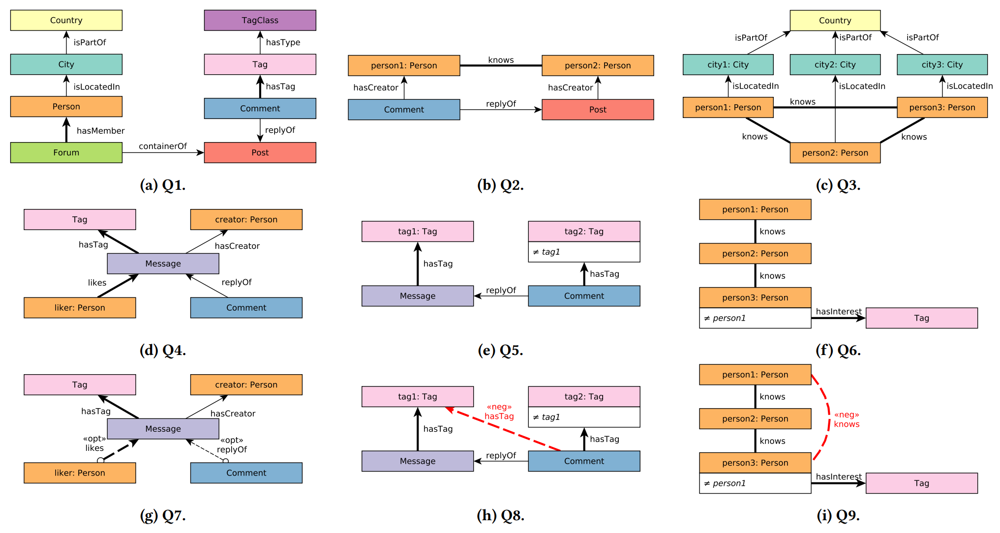

# Comparative Analysis of Graph Data Modeling and Querying in Neo4j and PostgreSQL

This repository contains the code and scripts for the comparative analysis of graph data modeling and querying in Neo4j
and PostgreSQL. The analysis used the LDBC SNB and LSQB benchmarks as a foundation. 

## Labelled Subgraph Query Benchmark (LSQB)

:page_facing_up: [LSQB: A Large-Scale Subgraph Query Benchmark](https://dl.acm.org/doi/pdf/10.1145/3461837.3464516),
GRADES-NDA'21
paper ([presentation](https://docs.google.com/presentation/d/13B5XwwSlgi-r3a9tKNxo8HmdIRzegO6FMB-M6I1RW0I))

### Overview

A benchmark for subgraph matching but with type information (vertex and edge types). The primary goal of this benchmark
is to test the query optimizer (join ordering, choosing between binary and n-ary joins) and the execution engine (join
performance, support for worst-case optimal joins) of graph databases. Features found in more mature database systems
and query languages such as date/string operations, query composition, complex aggregates/filters are out of scope for
this benchmark.

The benchmark consists of the following 9 queries:



Inspirations and references:

* [VLDB'19 keynote by Tamer Özsu](https://vldb2019.github.io/files/VLDB19-keynote-1-slides.pdf)
* [CACM'21 technical perspective paper on graphs](https://dl.acm.org/doi/pdf/10.1145/3434642)

### Getting started

#### Install dependencies

1. Install Docker on your machine.

1. (Optional) Change the location of Docker's data
   directory ([instructions](https://github.com/ftsrg/cheat-sheets/wiki/Docker#move-docker-data-folder-to-a-different-location)).

1. Install the required dependencies:

   ```bash
   scripts/install-dependencies.sh
   ```

1. (Optional) "Warm up" the system using `scripts/benchmark.sh`, e.g. run all systems through the smallest `example`
   data set. This should fill Docker caches.

#### Creating the input data

Data sets should be provided in two formats:

* `data/social-network-sf${SF}-projected-fk`: projected foreign keys, the preferred format for most graph database
  management systems.
* `data/social-network-sf${SF}-merged-fk`: merged foreign keys, the preferred format for most relational database
  management systems.

An example data set is provided with the substitution `SF=example`:

* `data/social-network-sfexample-projected-fk`
* `data/social-network-sfexample-merged-fk`

Pre-generated data sets are available in
the [SURF/CWI data repository](https://repository.surfsara.nl/datasets/cwi/lsqb).

To download the data sets, set the `MAX_SF` environment variable to the size of the maximum scale factor you want to
use (at least `1`) and run the download script.

For example:

```bash
export MAX_SF=3
scripts/download-projected-fk-data-sets.sh
scripts/download-merged-fk-data-sets.sh
```

For more information, see
the [download instructions and links](https://github.com/ldbc/data-sets-surf-repository/#labelled-subgraph-query-benchmark-lsqb).

##### Running the benchmark

The benchmark run consists of two key steps: loading the data and running the queries on the database.

Some systems need to be online before loading, while others need to be offline. To handle these differences in a unified
way, we use three scripts for loading:

* `pre-load.sh`: steps before loading the data (e.g. starting the DB for systems with online loaders)
* `load.sh`: loads the data
* `post-load.sh`: steps after loading the data (e.g. starting the DB for systems with offline loaders)

The `init-and-load.sh` script calls these three scripts (`pre-load.sh`, `load.sh`, and `post-load.sh`).
Therefore, to run the benchmark and clean up after execution, use the following three scripts:

* `init-and-load.sh`: initialize the database and load the data
* `run.sh`: runs the benchmark
* `stop.sh`: stops the database

Example usage that loads scale factor 0.3 to Neo4j:

```bash
cd neo
export SF=0.3
./init-and-load.sh && ./run.sh && ./stop.sh
```